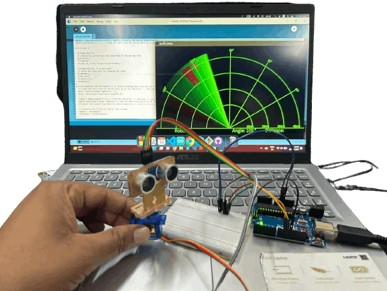

# Arduino Project – Ultrasonic-Based Radar System

Radar is an object detection system that uses radio waves to determine the range, altitude, direction,
or speed of objects. It can be used to detect aircraft, ships, spacecraft, guided missiles, motor vehicles,
weather formations, and terrain. The radar dish or antenna transmits pulses of radio waves or microwaves
which bounce off any object in their path. The object returns a tiny part of the wave's energy to a dish or
antenna which is usually located at the same site as the transmitter

## INTRODUCTION
Arduino is an open-source electronics platform based on easy-to-use hardware and software.
Arduino boards are able to read inputs - light on a sensor, a finger on a button, or a Twitter
message - and turn it into an output - activating a motor, turning on an LED, publishing
something online. You can tell your board what to do by sending a set of instructions to the
microcontroller on the board. To do so you use the Arduino programming language (based

- Magnetron generates high-frequency radio waves.
- Duplexer switches magnetron through to antenna.
- Sticky navbar with style changes on scroll
-  Antenna acts as transmitter, sending narrow beam of radio waves through the air
- Form & input styles
- Testimonials
  
